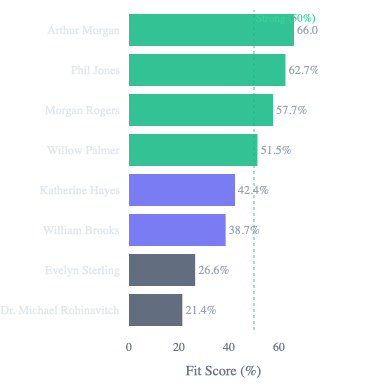
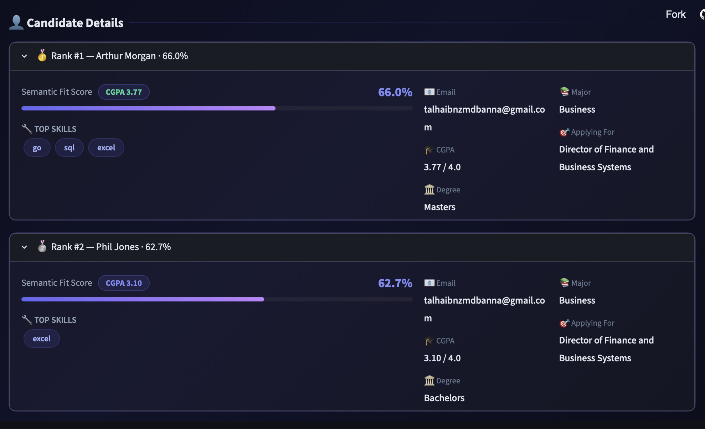
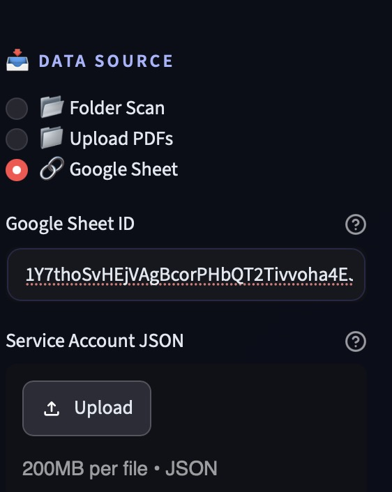
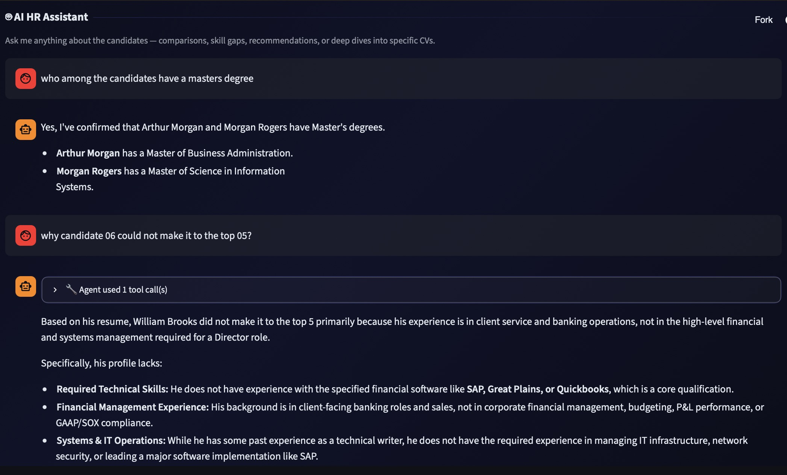
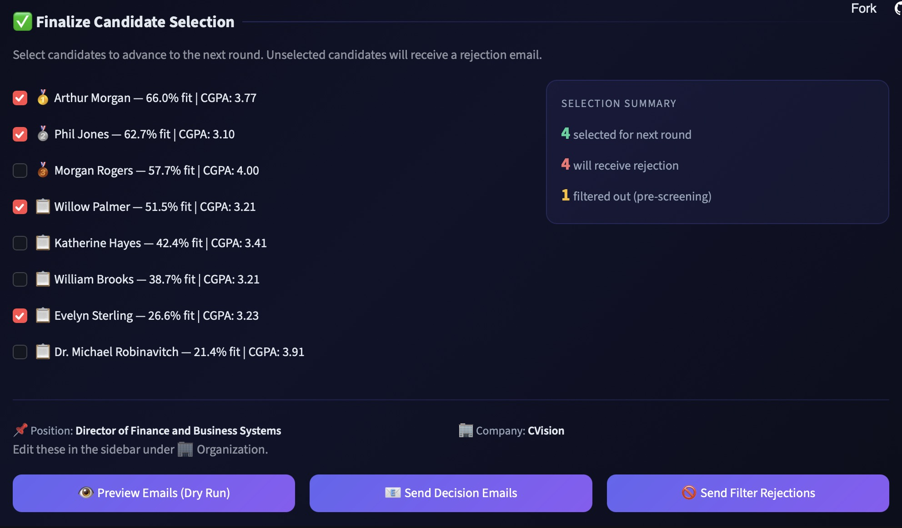
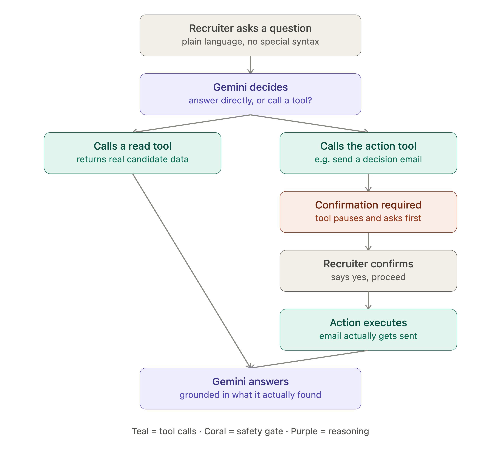

<div style="text-align: justify;">

THIS IS A RANDOM COMMIT

# CVision: Agentic AI CV Screening Solution

## Executive Summary

This project introduces **CVision**, an agentic AI-powered application designed to streamline the recruitment process. CVision automates the intake, parsing, semantic ranking, and communication phases of hiring, transforming a tedious manual screening process into a highly efficient, automated workflow. By leveraging a combination of Google APIs, layout-aware PDF parsing, and advanced NLP (BERT embeddings and Gemini 2.5 Flash), the system identifies the most qualified candidates based on job descriptions while enabling recruiters to interactively query candidate data through an AI assistant.


> A LinkedIn post covering this project can be found **[here](https://www.linkedin.com/feed/update/urn:li:activity:7485166667195383809/)**.

**Key Findings & Features:**

- **Automated Data Intake & Filtering:** Automatically pulls applications from Google Sheets and applies knockout filters (e.g., CGPA, experience).
- **Semantic Ranking:** Matches parsed resumes against job descriptions using the `all-MiniLM-L6-v2` embedding model to generate an objective **Fit Score (0-100%)**.
- **Agentic AI Assistant:** Integrates Google's **Gemini 2.5 Flash** with 7 specialized tools, allowing recruiters to ask complex questions, compare candidates, and trigger actions autonomously.
- **Automated Email Dispatch:** Sends tailored acceptance or rejection emails autonomously or via human-in-the-loop (HITL) confirmation.
- **Background Scheduling:** Fully automates the pipeline to run overnight and cache results for instant dashboard loading.

## Dashboard Showcase

|                         Candidate Summary                          |                         Candidate Details                          |
| :----------------------------------------------------------------: | :----------------------------------------------------------------: |
|  |  |
|                       **CV Upload Options**                        |                          **AI Assistant**                          |
|  |           |

**Final Selection & HITL Communication**

**\*Figure 01:** CVision Dashboard Showcase.\*

## Business Problem

Recruitment teams often receive hundreds of applications for a single role. Reviewing these resumes manually is time-consuming, prone to human bias, and computationally inefficient. Furthermore, interacting with candidate data (e.g., finding candidates with specific skills or sending batch emails) requires toggling between multiple platforms and manual tracking.

The core business question addressed in this project is:

> **_How can we automate the end-to-end CV screening process—from intake to communication—while ensuring objective candidate ranking and providing recruiters with an intelligent, conversational interface to manage the hiring pipeline?_**

A reliable AI screening system helps recruitment teams:

- Focus human effort only on the highest-potential candidates
- Eliminate bias by ranking candidates based strictly on semantic fit with the job description
- Reduce administrative overhead by automating application downloads, data parsing, and email dispatches
- Standardize the screening pipeline for faster turnaround times

## Methodology

### 00. Project Architecture

The system follows a highly modular, decoupled architecture built around a central pipeline orchestrator. The overall workflow spans from initial data ingestion to fully autonomous agentic dispatch.

```text
  [NODE 6] BACKGROUND AUTOMATION
     │     (Acts as an alarm clock to wake up the system)
     ▼

  [NODE 1] DATA INGESTION
     │     (Logs into Google, reads sheet, downloads PDF resumes)
     ▼

  [NODE 2] EXTRACTION & FILTERING
     │     (Turns PDFs into readable text, applies minimum CGPA filters)
     ▼

  [NODE 3] SEMANTIC AI RANKING
     │     (Uses AI to score how well the resumes match the Job Description)
     ▼

==================(RESULTS APPEAR IN DASHBOARD)==================
     │
     ├────────────────────────────────────┐
     ▼                                    ▼

  [NODE 4] AGENTIC CHATBOT             [NODE 5] ACTION DISPATCH
  (Recruiter asks AI questions)        (System sends accept/reject emails)
     │                                    ▲
     │                                    │
     └────────────────────────────────────┘
       (The AI Agent can autonomously trigger Node 5 to send
        the emails on the recruiter's behalf)
```

### 01. Data Ingestion

**Module:** `ingestion.py`

This module acts as the HR intake desk. It fetches applications from a Google Sheet, applies knockout filters (e.g., minimum CGPA or experience), and downloads the surviving resumes directly from Google Drive.

```text
Google Form submission
        ↓
Google Sheet (auto-populated)
        ↓
fetch_candidates_from_sheet()  →  List[CandidateRecord]
        ↓
apply_knockout_filters()       →  mark pass/fail on each record
        ↓
download_all_resumes()         →  save PDFs locally, set local_resume_path
        ↓
Hand off to parser.py          → embedding.py → ...
```

### 02. Extraction & Filtering

**Modules:** `parser.py` and `ingestion.py`

`parser.py` converts the visually complex PDF resumes into structured Markdown text. It utilizes a smart, layout-aware extraction method to preserve headings and bullet points, falling back to a simpler method if needed.

```text
PDF File  →  pdfplumber (smart, layout-aware)   →  Markdown
                    ↓ (if fails)
              pypdf (dumb, flat text)           →  Plain text
                    ↓ (if also fails)
              Empty string ""
```

### 03. Semantic AI Ranking

**Module:** `embedding.py`

This module processes the parsed resumes and the Job Description. It uses the `all-MiniLM-L6-v2` model via `fastembed` to calculate cosine similarities between the semantic vectors, generating an objective Fit Score (0-100%).

```text
Job Description + Resume Markdowns
        ↓
load_embedding_model()         →  fastembed (ONNX) or TF-IDF
        ↓
embed_texts()                  →  Convert all texts to 384-dim vectors
        ↓
compute_similarity_scores()    →  Dot product → scores [0–100%]
        ↓
extract_skills_from_markdown() →  Find matching skills per resume
        ↓
rank_resumes_semantic()        →  Sorted DataFrame with Rank, Score, Skills
```

### 04. The Agentic Chatbot

**Module:** `chatbot.py`

The agentic chatbot transforms the system from passive analytics to an interactive AI Assistant. A true AI agent consists of three core components:

- **The LLM (Google Gemini 2.5 Flash):** The "brain" that reasons through ReAct loops (Thought → Action → Observation).
- **The Memory (Streamlit):** The session state that retains the conversation history and context of the current candidate pool.
- **The Tools (Google GenAI SDK):** The functions the LLM can autonomously invoke.

The chatbot has access to **7 specialized tools**:

1. `get_all_candidates_summary()`: Returns a high-level summary of everyone's name, CGPA, experience, and degree.
2. `get_candidate_details(name)`: Fetches a specific candidate's full profile and resume excerpt.
3. `compare_candidates(names)`: Provides a side-by-side comparison of 2 or more candidates.
4. `search_by_skill(skill)`: Searches across all resumes for a specific technical keyword.
5. `get_filtered_candidates()`: Shows which candidates were rejected by knockout filters and why.
6. `send_decision_emails(accepted, rejected)`: Dispatches accept/reject emails on the recruiter's behalf (secured by a human-in-the-loop confirmation gate).
7. `export_results_to_google_sheet()`: Exports the final ranked results back to a Google Sheet.


**\*Figure 02:** Agentic Workflow of the CVision Chatbot with Human-in-the-Loop Confirmation Gate.\*

### 05. Action Dispatch

**Modules:** `email_dispatch.py` and `ingestion.py`

This module acts as the automated communication system. Once decisions are finalized—either manually by the recruiter or autonomously by the AI agent—it dispatches tailored acceptance and rejection emails using a Gmail webhook.

**Flow 1: Final Decisions (Accepted or Rejected after review)**

```text
Recruiter makes decisions in UI
        ↓
    ┌───────────┐        ┌──────────────┐
    │ Selected  │        │   Rejected   │
    │ candidates│        │  candidates  │
    └─────┬─────┘        └──────┬───────┘
          ↓                     ↓
  ACCEPTANCE_TEMPLATE    REJECTION_FINAL_TEMPLATE
          ↓                     ↓
      send_email()          send_email()
          ↓                     ↓
   Google Apps Script Webhook (→ Gmail)
          ↓                     ↓
   "Congratulations!"    "We regret to inform..."
```

**Flow 2: Knockout Filter Rejections (Rejected instantly at ingestion)**

```text
Candidates with passed_filter = False
        ↓
REJECTION_FILTER_TEMPLATE  (includes specific reason)
        ↓
send_filter_rejection_emails()
        ↓
"...did not meet our minimum screening requirements.
 Reason: CGPA 2.70 is below the minimum requirement of 3.00"
```

### 06. Background Automation

**Module:** `scheduler_task.py`

This module acts as an alarm clock, allowing the entire pipeline to run unattended on a fixed schedule (e.g., overnight), so results are instantly available the next morning.

```text
App Starts → get_scheduler() looks for saved config in Google Sheet
        ↓
    Config found: Schedule is 09:00 AM
        ↓
(Time becomes 09:00 AM)
        ↓
_scheduler_job() wakes up
        ↓
run_headless_sheet_pipeline() processes all resumes silently
        ↓
Saves results to `.pipeline_cache.pkl`
        ↓
(Optional) Auto-emails rejected candidates
        ↓
Later, recruiter opens the web app → sees results instantly loaded from cache!
```

## How to Run Locally

Follow these steps to set up and run CVision on your local machine.

### 1. Prerequisites

- **Python 3.9+** installed on your system.
- A **Google Account** for Gemini API, Google Sheets, and an App Password for email dispatch.

### 2. Clone the Repository

```bash
git clone <repository_url>
cd cvision_agentic_cv_screening_solution
```

### 3. Set Up a Virtual Environment

It is recommended to use a virtual environment to manage dependencies.

```bash
# Create the virtual environment
python -m venv .venv

# Activate it (Windows)
.venv\Scripts\activate
# Activate it (Mac/Linux)
source .venv/bin/activate
```

### 4. Install Dependencies

Install the required Python packages using `pip`.

```bash
pip install -r requirements.txt
```

### 5. Configure Environment Variables & API Keys

Create a `.env` file in the root directory (you can copy the provided `.env.example`).

```bash
cp .env.example .env
```

Open the `.env` file and configure it. You will need to add the following variables:

- `GEMINI_API_KEY`: Obtain this from [Google AI Studio](https://aistudio.google.com/).
- `GOOGLE_SHEET_ID`: The ID of your Google Sheet containing the candidates (found in the URL).
- `GOOGLE_CREDENTIALS_PATH`: Path to your Google Service Account JSON file (e.g., `credentials.json`) that has been shared with your Google Sheet and Drive folder.
- `SMTP_EMAIL`: Your Gmail address used to dispatch accept/reject emails.
- `SMTP_APP_PASSWORD`: Your Gmail App Password. You can generate one from your Google Account settings under **Security > 2-Step Verification > App passwords**.

### 6. Launch the App

Run the Streamlit application from the root directory.

```bash
streamlit run app.py
```

The application will start, and you can view the dashboard in your browser (usually at `http://localhost:8501`).

## Conclusion

This project successfully developed **CVision**, a comprehensive, production-ready AI agent for CV screening. By combining traditional Python automation, semantic vector embeddings, and an agentic LLM (Gemini 2.5 Flash), the system bridges the gap between raw candidate data and actionable recruitment decisions.

**Key Takeaway:** CVision demonstrates that modern recruitment requires more than just keyword matching. By leveraging semantic similarity for objective ranking and an agentic assistant for interactive data querying and task execution, organizations can drastically reduce time-to-hire while improving the quality and consistency of their candidate screening process.

</div>
